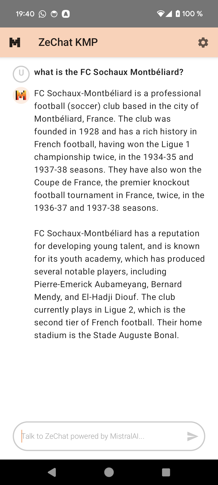
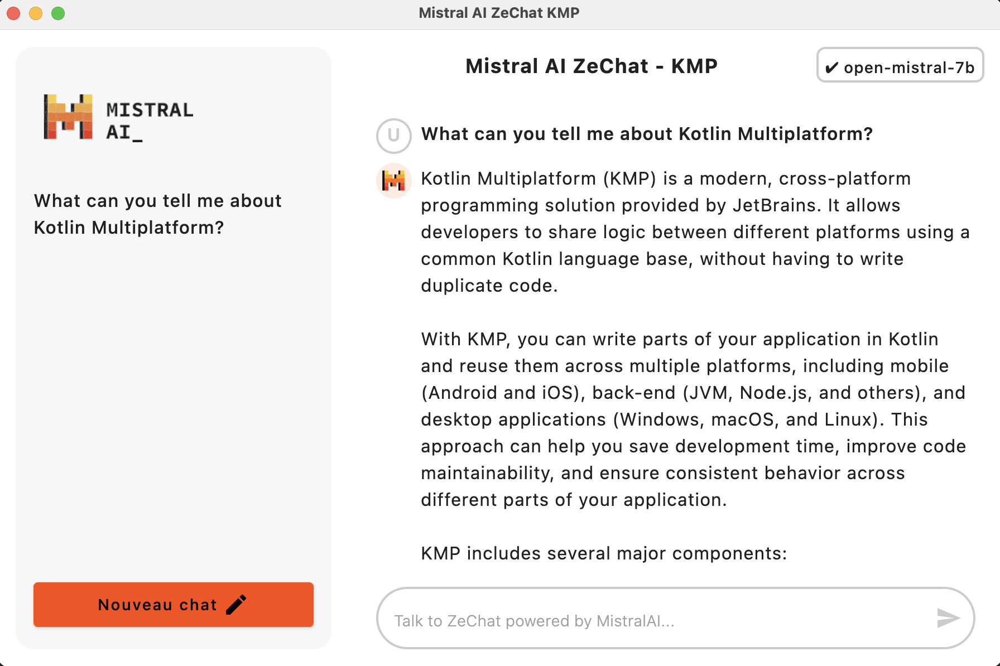
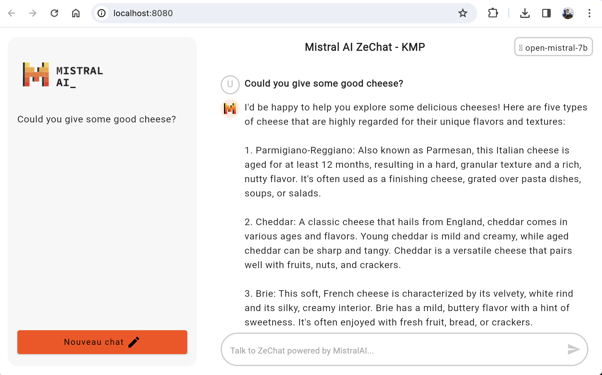

# Mistral AI SDK and ZeChat for Kotlin Multiplatform 🐸

**Mistral AI SDK** for Kotlin Multiplatform (**KMP**) with support for Android, iOS, Desktop and Web (Wasm).
Sample projects to show the [Mistral AI](https://mistral.ai/) capabilities. This project has just started so expect breaking changes
when using the library.

## The Library
The library is based on the Mistral API [documentation](https://docs.mistral.ai/api/) and built with Kotlin Multiplatform
and the Ktor client library. With it, you can communicate with the Mistral API in order to perform following actions:
- Get the Mistral AI models
- Start a chat (or a stream chat) with the assistant
- Create embeddings to embed sentences in the model

### Setup
You can easily set up the Mistral AI client with the following piece of code for example:

```kotlin
val mistralClient = MistralClient(
    apiKey = "YOUR_API_KEY",
)

val result: Result<List<Model>> = mistralClient.getModels()
val firstModel = result.getOrDefault(emptyList()).firstOrNull()

val chatResult = mistralClient.chat(
    model = firstModel.id,
    messages = listOf(Message(content = "What are the best pasta recipes?")),
    params = ChatParams(safePrompt = false),
)
```
### Releases
The latest release will be available on Maven Central.

_Coming soon_

## The sample apps: ZeChat
The sample apps showcase the Mistral AI SDK capabilities. There, you can find an application called ZeChat which allow
the user to have a conversational chat with the different Mistral AI models. The UI has been written thanks to Compose
Multiplatform so every app shares the same UI code which is located in `composeApp/src/commonMain`.

In order to play with ZeChat apps, you need to get your own Mistral API Key and add it to the `local.properties` file
located in the project root. Get your API key on the [Mistral Console](https://console.mistral.ai/).

Alternatively, when playing with the [Web Sample app](https://oleur.github.io/mistral-ai-kmp/), there will be a popup to
directly enter your API key to play the ZeChat.

- Android 


- iOS (_coming soon_)

- Desktop


- Web (Wasm)


**ℹ️ Note:** The Mistral AI library for KMP isn't published to maven yet. I'll update once the library is live
and available. Meanwhile, you can fork the project and use the library as a module dependency in your app

## License

<pre>
Copyright 2024 Julien Salvi

Licensed under the Apache License, Version 2.0 (the "License");
you may not use this file except in compliance with the License.
You may obtain a copy of the License at

    http://www.apache.org/licenses/LICENSE-2.0

Unless required by applicable law or agreed to in writing, software
distributed under the License is distributed on an "AS IS" BASIS,
WITHOUT WARRANTIES OR CONDITIONS OF ANY KIND, either express or implied.
See the License for the specific language governing permissions and
limitations under the License.
</pre>
